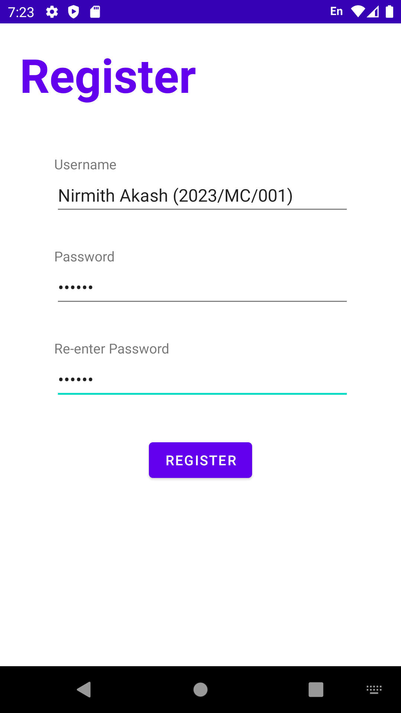
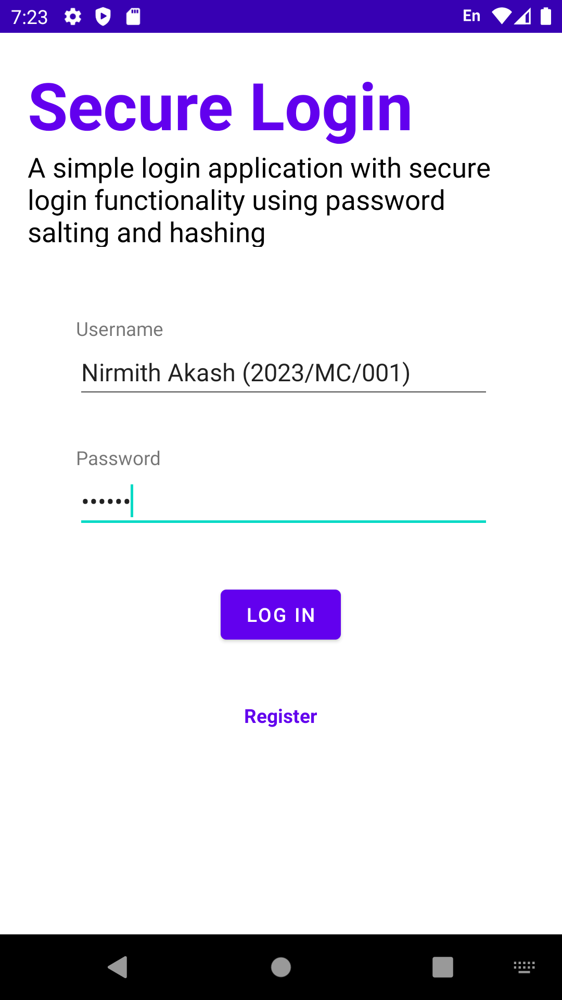
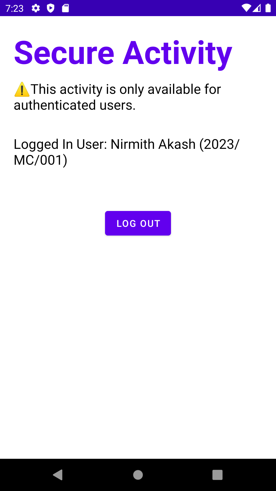

# 🔐 Secure Android Native Login Application

A simple and secure native Android application built using Java and XML that implements user **registration**, **login**, and **authentication**. Passwords are securely handled using **salting and hashing** to ensure safety and privacy.

## 📱 Features

- User Registration
- Login with hashed & salted password verification
- Protected (authenticated-only) screen
- Logout functionality
- Clean Material UI
- Built entirely with native Android SDK (no third-party libraries for auth)

---

## 🧪 Screenshots

### 🔸 Register Screen,  Login Screen, Secure Activity (Authenticated)
<p align="center">
  
  
  
</p>

> 📂 Screenshots are located in the `screenshots/` folder in the repository.

---

## 🏗️ Tech Stack

- Language: Java
- UI: XML Layouts
- Platform: Android SDK
- Security: Hashing + Salting (Java `MessageDigest`)

---

## 🚀 Getting Started

### Prerequisites
- Android Studio (latest version)
- Android SDK 26+
- Gradle (comes with Android Studio)

### Installation
1. Clone the repository:
   ```bash
   git clone https://github.com/AnawaratneMANA/secure-android-native-login-application
   ```
2. Open the project in Android Studio.
3. Run the app on an emulator or Android device.

---

## 🤝 Contributing

Pull requests are welcome. For major changes, please open an issue first to discuss what you would like to change.

---

## 📜 License

This project is licensed under the [MIT License](LICENSE).

---

## 🔗 Repository

🔗 [GitHub - secure-android-native-login-application](https://github.com/AnawaratneMANA/secure-android-native-login-application)
